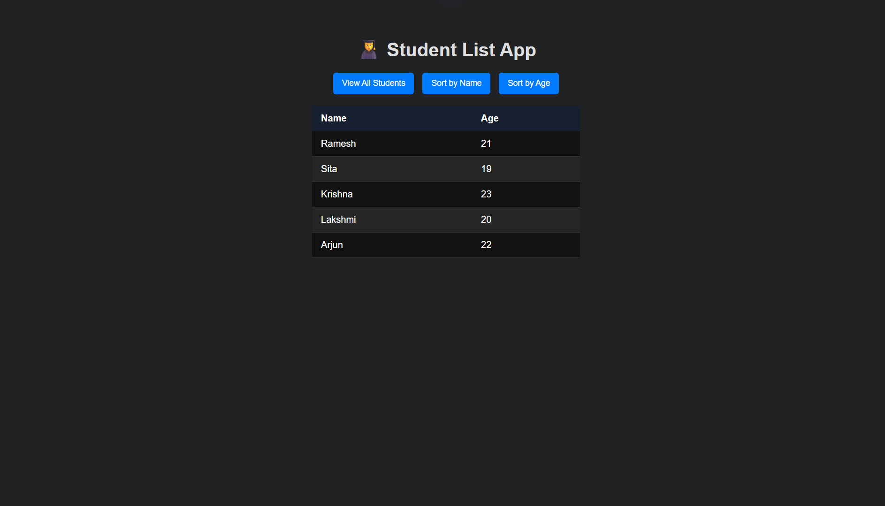

# 🧑‍🎓 Student List App

This is a **mini-project** built as part of the  
**[UI Developer Training Program](https://github.com/MylapalliYesebu/UI-Developer-Training-Projects.git)** (Phase 2),  
a CSR initiative of **Infosys Foundation** at **Ideal Institute of Technology**.

---

## 📋 Description

The Student List App is a simple web application that displays a list of students with their names and ages.
It allows users to view all students, sort them alphabetically by name, or numerically by age — all with one click.

This project focuses on basic DOM manipulation and JavaScript sorting in a clean, user-friendly interface.

---

## 🛠️ Tech Stack

- **HTML** – Structure of the web page  
- **CSS** – Styling and layout  
- **JavaScript** – Logic for displaying and sorting students  

---

## 🎯 Features

✅ View all students in a table  
✅ Sort students alphabetically by **name**  
✅ Sort students numerically by **age**  
✅ Responsive and minimal user interface 

---

## 🧠 Learning Objectives

This project helped me practice and understand:

- Array of objects in JavaScript
- Sorting strings and numbers
- DOM selection and table manipulation
- Event listeners for button clicks
- Clean UI structure and responsive styling 

---

## 📸 Screenshot

  

---

## 🧪 Live Demo

👉 [View the live demo](https://mylapalliyesebu.github.io/student-list/)  

---

## 🔗 Related Projects

This project is part of my full UI Developer Training Project series:  
👉 [UI Developer Training Projects](https://github.com/MylapalliYesebu/UI-Developer-Training-Projects)  

---

## 👤 Author

- **Mylapalli Yesebu**  
- [GitHub](https://github.com/MylapalliYesebu)  
- 📧 [yesebymylapalli08@gmail.com](mailto:yesebymylapalli08@gmail.com)
